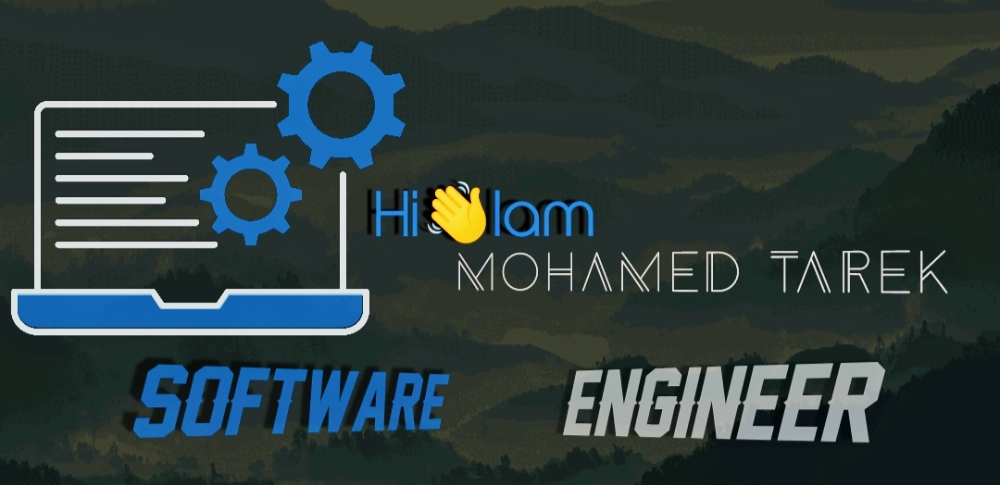

 
		   

 

- 🔭 أنا حاليًا العمل على تطبيق سطح المكتب ** بركة **

- 👨‍💻 جميع مشاريعي متاحة على [https://github.com/Mohamed-Tarek11111](https://github.com/Mohamed-Tarek11111)

- 📫 كيف تواصل معي ** mm1632002 @ gmail.com **

<h3 align = "left"> تواصل معي: </ h3>

 
 <h3 align =" left
"

> اللغات والأدوات: </h3>

    <a href="https://www.w3schools.com/css/" target="_blank" rel="noreferrer">  </ a >       <a href="https://www.java.com" target="_blank" rel="noreferrer"> < img src = "https://raw.githubusercontent.com/devicons/devicon/master/icons/java/java-original.svg" alt = "java" width = "40" height = "40" /> </ a >   <a href="https://www.mysql.com/" target="_blank" rel="noreferrer">  </ a>  <a href="https://www.python.org" target="_blank" rel="noreferrer"> < img src = "https://raw.githubusercontent.com/devicons/devicon/master/icons/python/python-original.svg" alt = "python" width = "40" height = "40" /> </ a > 
svg "alt =" python "width =" 40 "height =" 40 "/> </a> 
svg "alt =" python "width =" 40 "height =" 40 "/> </a> 

  

 & nbsp؛  

  

<h3 align = "center"> مطور واجهة أمامي شغوف من الهند </ h3>

  

  

